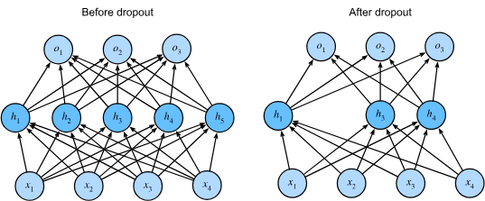

# Dropout

One way to measure the generalization of a model is that the function should not be
sensitive to small changes to its inputs aka some random noise.

This lead to the idea of _dropout_, which involves injecting noise
while computing each internal layer during forward propagation.
The method is called _dropout_ because we internally drop out some neurons during training.
On each iteration, standard dropout consists of zeroing out some fraction of
the nodes.

In standard dropout regularization, each intermediate activation $h$ is replaced
by a random variable $h'$ where p is the dropout propability:

$$
\begin{aligned}
h' =
\begin{cases}
    0 & \textrm{ with probability } p \\
    \frac{h}{1-p} & \textrm{ otherwise}
\end{cases}
\end{aligned}
$$

Typically, we disable dropout at test time.
Given a trained model and a new example, we do not drop out any nodes and thus do not need to normalize.
However, there are some exceptions: some researchers use dropout at test time as a heuristic for estimating the uncertainty of neural network predictions:
if the predictions agree across many different dropout outputs, then we might say that the network is more confident.

