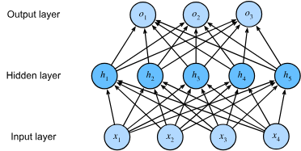
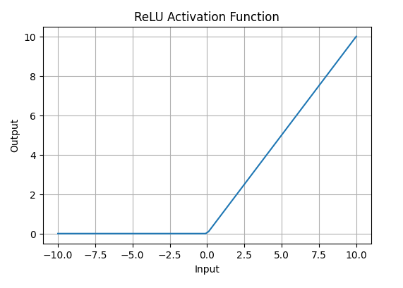
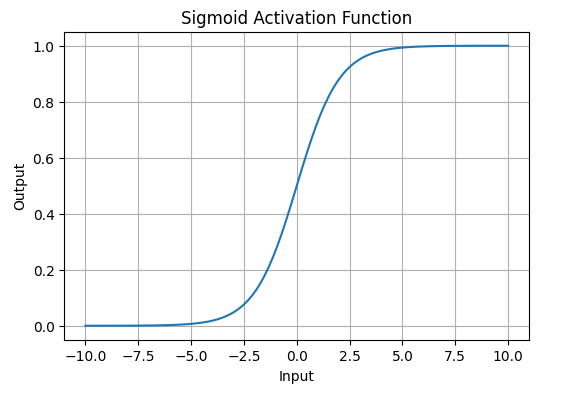

# Multilayer Preceptrons

Up till now all our models used simple linear transformation,
recall [Linear Regression](/1_linear_regression/Linear_Regression.md), and [Softmax Regression](/2_classification/softmax_regression.md).
This linearity is a strong assumtion and is not sufficent for all problems.

This linearity implies the weaker assumption of monotonicity:
an increase in a feature must consistently cause either an increase or a decrease in the model's output,
depending on the feature's weight.

This won't work for model that predicts loan repayments based on income,
Higher income is always associated with a higher probability of repayment (monotonic),
but the relationship likely isn't linear (e.g., $0 \to \$50k$ increase has a larger impact than $\$1M \to \$1.05M$).
This could be fixed by preprocessing the data.

But this will fail in image classification problem,
As changing the intensity of a single pixel shouldn't always increase or decrease the likelihood of "dog",
especially since inverting the whole image preserves the category.

And Here comes _MLPs_ that solve this by
learning a representation via _hidden layers_ and a linear predictor i.e _classifier_ that acts upon that learned representation.

## Deep neural networks

The easiest way to do this is to stack many fully connected layers on top of one another.
We can think of the first $L-1$ as our representation and the final as our classifier.

  

Since the input layer doesn't do any calculations,
this network has two layers with 5 hidden neurons.

### From Linear to Nonlinear

If we simply add one linear layer, we won't have achived anything,
because the output of the hidden layer $\mathbf{H}$ and the final output would be:

$$
\mathbf{H} = \mathbf{X} \mathbf{W}^{(1)} + \mathbf{b}^{(1)} \\
\mathbf{O} = \mathbf{H}\mathbf{W}^{(2)} + \mathbf{b}^{(2)}
$$

If we only used affine functions, you gain _nothing_,
because an affine function of an affine function is still an affine function $\mathbf{W} = \mathbf{W}^{(1)}\mathbf{W}^{(2)}$ and $\mathbf{b} = \mathbf{b}^{(1)} \mathbf{W}^{(2)} + \mathbf{b}^{(2)}$, resulting in:

$$
\mathbf{O} = \mathbf{X} \mathbf{W} + \mathbf{b}
$$

The solution is to use _nonlinear activation function_ $\sigma$ that would be applied at the output of each hidden layer.
Giving us:

$$
\mathbf{H} = \sigma(\mathbf{X} \mathbf{W}^{(1)} + \mathbf{b}^{(1)}) \\
\mathbf{O} = \mathbf{H}\mathbf{W}^{(2)} + \mathbf{b}^{(2)}
$$

## Activation Functions

Activation functions are critical components of the MLP,
as they grant the model the ability to approximate a wide range of complex,
non-linear functions.

### Rectified Linear Unit (ReLU)

The ReLU function is the most popular choice in deep networks.
It is defined as:

$$
\text{ReLU}(x) = \max(0, x)
$$

Its derivative is particularly well-behaved,
being 1 for positive inputs and 0 for negative inputs.

This property makes optimization more stable and has historically helped to
mitigate the vanishing gradient problem that plagued earlier deep networks.

### Sigmoid Function

The sigmoid function transforms inputs into the range $(0, 1)$ and is defined as:

$$
\text{sigmoid}(x) = \frac{1}{1 + e^{-x}}
$$

It suffers from severe saturation at both large positive and large negative inputs,
causing gradients to vanish for large $|x|$ and stalling optimization.

Consequently,
it is primarily used in the output layer for **binary classification** tasks
(as the final probability output)
but is rarely used in hidden layers of modern deep networks.

### Tanh Function

The hyperbolic tangent function (tanh) maps inputs to the range $(-1, 1)$ and is defined as:

$$
\text{tanh}(x) = \frac{1 - e^{-2x}}{1 + e^{-2x}}
$$

The tanh function is a rescaled version of the sigmoid,
$\text{tanh}(x) = 2 \text{sigmoid}(2x) - 1$.

Since it is symmetric around the origin (centered at 0),
it is often preferred over the sigmoid,
although it also suffers from the vanishing gradient problem when inputs are large.
