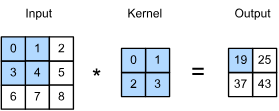
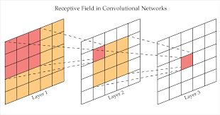
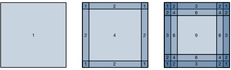
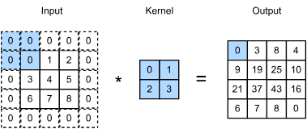

The rich spactial structure of image data is lost when the images are
flattened into one dimentional vectors to use in a fully connected [MLP](../3_mlps/multilayer_preceptrons.md).

Also higher resoulotion images, requires an infeasible number of parameters,
which is not very effiecent.

To exploit the structure of images and constrain parameter count,
a network suitable for vision should satisfy:

1. **Translation Invariance**: The network should respond similarly to the 
visual feature (e.g. an edge or an object) regarldless of it's precise location in the input image.

2. **Locality**: The earliest layer should focus on local regions of the input,
as neighboring pixels are highly related.

3. **Hierarchy**: Deeper layers should progressively capture longer range and more complex features.

These principles force the fully connected layer to turn into the new **Convolutional Layer** which has:

- Parameter sharing(Translation Invariance): instead of having a unique weight 
connecting every input pixel to every output neuron,
a small set of weights called *the kernel* (or filter)
is reused across the entire image.

- Small Kernel Size(Locality): The kernel is kept small,
which means the output value (feature map), 
the netwok only looks at very local *neighborhood* of pixels in the input.

## Convolutions for Images

In the two dimentional convolutional (cross correlation to be precise), 
we begin with the convolutional window positioned at the upper left corner 
of the input tensor and slide it across the input tensor from left to right and top to bottom.

Note that along each axis, the output size is slightly smaller than the input size. 
because the kernel has widht and height greater than 1, 
we can only properly compute the cross-correlation for locations where the kernel fits wholly within the image.

A convolutional layer cross correlates the input and the kernal and
adds a scalar bias to produce the output. this is called a *feature map*.

In CNNs for any element $x$ of some layer, it's *receptive field* refers
to all the elements from all the previous layrs thay may affect the
calculations of $x$ during the forward pass.

## Padding and Stride

To solve the issue that we tend to lose pixels of the perimeter of our image.
Consider the next image which depicts the pixel utilization as a function of the convolution kernel size and the position within the image.
The pixels in the corners are hardly used at all.

One straightforward solution to this problem is to add extra pixels of filler around the boundary of our input image,
thus increasing the effective size of the image. 
Typically, we set the values of the extra pixels to zero.

In the previous examples, 
we defaulted to sliding one element at a time. 
However, sometimes, either for computational efficiency or because we wish to downsample, 
we move our window more than one element at a time, 
skipping the intermediate locations. 
This is particularly useful if the convolution kernel is large since it captures a large area of the underlying image.

We refer to the number of rows and columns traversed per slide as *stride*

In general, for an input of $n_h \times n_w$ with padding $p_h, p_w$ 
and a kernel of size $k_h \times k_w$ with a stride of $s_h, s_w$

the output shape is 

$$
\lfloor(n_\textrm{h}-k_\textrm{h}+p_\textrm{h}+s_\textrm{h})/s_\textrm{h}\rfloor \times \lfloor(n_\textrm{w}-k_\textrm{w}+p_\textrm{w}+s_\textrm{w})/s_\textrm{w}\rfloor.
$$

## Pooling

Pooling layers are inserted into CNNs to achieve **spatial downsampling** of the feature maps,
reducing computational load and providing a degree of robustness to small spatial shifts in the features.

### 7.5.1 The Pooling Operation

Unlike convolutional layers, which use a learnable kernel, 
pooling layers perform a fixed **aggregation function** over a local region defined by a window or `pool_size`.

* **Operation:** A pooling window of size $p_h \times p_w$ slides across the input tensor (feature map) by a defined **stride**, 
and the selected aggregation value replaces the entire local region in the output.
No kernel weights are involved.
* **Channel Handling:** Pooling is applied to **each input channel separately**. Consequently, the pooling layer's output has the **same number of channels** as its input.
* **Dimensionality Reduction:** Similar to convolutions without padding, pooling reduces the spatial dimensions. If the input is $n_h \times n_w$ and the pool size is $p_h \times p_w$, the output size is $(n_h - p_h + 1) \times (n_w - p_w + 1)$ (when stride is 1 and padding is 0). This reduction is often significant, for instance, a $2 \times 2$ pool with stride 2 quarters the spatial resolution.

### Types of Pooling

The aggregation method defines the type of pooling layer:

| Pooling Type | Aggregation Function | Purpose |
| :--- | :--- | :--- |
| **Max-Pooling ($\text{MaxPool2D}$)** | Returns the **maximum** value in the pooling window. | Emphasizes the **strongest feature response** (e.g., the clearest edge) within a local area. |
| **Average-Pooling ($\text{AvgPool2D}$)** | Returns the **average** value in the pooling window. | Provides a **smoothed** version of the feature map, suitable for summarizing the general presence of a feature. |
