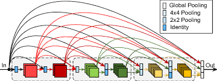

## 🌿 Densely Connected Networks (DenseNet)

**DenseNet** is the logical extension of ResNet's idea of connecting layers with identity mappings. Unlike ResNet, which uses **addition** to combine features, DenseNet relies on **concatenation** to maximize feature reuse throughout the network.

### From ResNet to DenseNet

- **ResNet:** Decomposes a function $f(\mathbf{x})$ into a simple term and a residual term: $f(\mathbf{x}) = \mathbf{x} + g(\mathbf{x})$. The addition operation combines information.
- **DenseNet:** Decomposes the function by concatenating the input $\mathbf{x}$ with the outputs of all subsequent functions $f_i$, leading to a sequence that captures increasingly higher-order features:
  $$\mathbf{x} \to \left[\mathbf{x}, f_1(\mathbf{x}), f_2\left(\left[\mathbf{x}, f_1\left(\mathbf{x}\right)\right]\right), \ldots\right]$$
- The name "DenseNet" reflects that the final layer is **densely connected** to the outputs of _all_ preceding layers via concatenation, promoting feature preservation.

---

### DenseNet Components

DenseNet models are constructed using two primary components: **Dense Blocks** and **Transition Layers**.

#### 1. Dense Blocks

- A dense block consists of multiple convolution blocks, typically using the "Batch Normalization, ReLU, and Convolution" structure.
- The key operation within the dense block is **concatenation**: the input and output of each convolution block are concatenated along the channel dimension before being passed to the next block.
- The number of output channels in each internal convolution block is called the **growth rate** (e.g., 32). This growth rate determines how many channels are added at each step, causing the overall number of channels to increase rapidly with depth.

#### 2. Transition Layers

- Since dense blocks continuously increase the number of channels, a **Transition Layer** is necessary to manage complexity.
- It performs two key functions:
  1. **Channel Reduction:** It reduces the number of channels using a $\mathbf{1 \times 1}$ convolution.
  2. **Spatial Downsampling:** It halves the height and width of the feature map using **average pooling** with a stride of 2.

### DenseNet Model Structure

The overall DenseNet architecture mirrors ResNet's macro structure:

1. **Stem:** Initial $7 \times 7$ convolution layer, Batch Normalization, ReLU, and $3 \times 3$ Max Pooling.
2. **Core:** A sequence of alternating **Dense Blocks** and **Transition Layers**. The transition layers reduce the feature map size and halve the number of channels between blocks.
3. **Head:** Final Global Average Pooling and a Fully Connected layer for classification.

### Discussion and Memory

While the feature reuse in DenseNet often leads to better computational efficiency and smaller model parameters than ResNet, the heavy use of **concatenation** requires storing the feature maps of all preceding layers for backpropagation. This can lead to **high GPU memory consumption**, sometimes requiring memory-efficient implementations to manage training.
