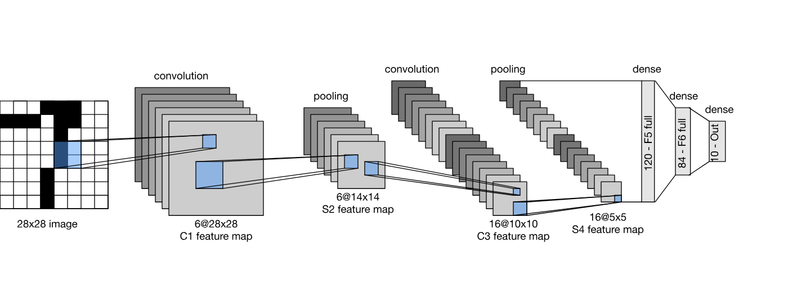
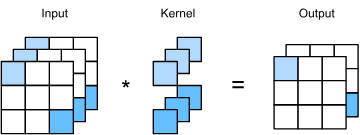
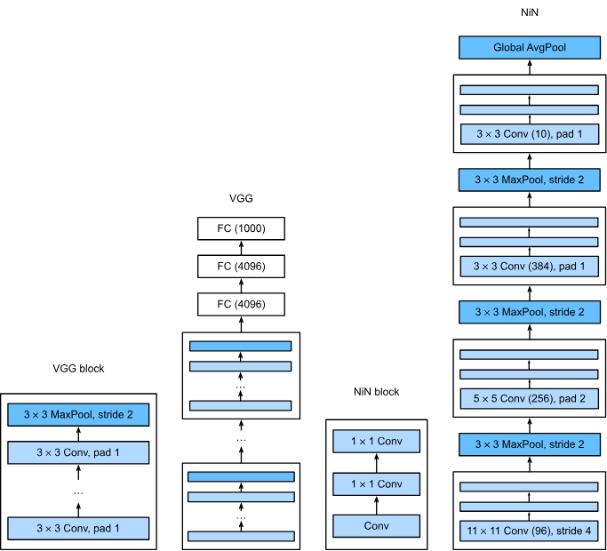
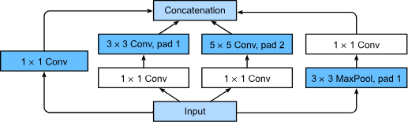
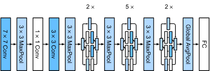

## LeNet

_LeNet_ was one of the first published CNNs to capture wide attention
for its performance on CV tasks.

At a high level, LeNet consists of two parts:

1. Convolutional Encoder: consisting of two convolutional layers
2. Dense Block: consisting of a three fully connected layers.

The basic units in each convolutional block are,
a convolutional layer, a sigmoid activation function,
and a subsequent average pooling operation.

> Note that while ReLUs and Max-Pooling work better,
> they had not yet been discovered.

## Modern CNNs

### AlexNet: Deep CNN

AlexNet, introduced in 2012,
is considered the first modern Deep Convolutional Neural Network (CNN).
It achieved a breakthrough performance in the ImageNet Large Scale Visual Recognition Challenge (ILSVRC),
significantly reducing the error rate and showcasing the power of deep learning for large-scale image classification.

AlexNet employed an 8-layer CNN, it looked similiar to LeNet but it was much wider and deeper

It also changed the sigmoid function to a simpler RelU activation function.
And it used Dropout regularization technique on the fully connected layers
to prevent overfitting, which was critical due to the network large number of
parameters.

### VGG: Networks Using Blocks

The VGG network (Visual Geometry Group, Simonyan and Zisserman, 2014)
focuses on making CNN architectures deeper by employing a uniform,
simple structure composed of convolutional blocks.
It was instrumental in shifting deep learning toward networks with numerous layers.

One of the problems of the basic building block of CNN (`Conv2d`=> `ReLU`=>`MaxPool2D`)
is that the resolution decreases quite rapidly vanishing the dimention of the input.

And here comes VGG which used multiple convolutions in between pooling downsampling in the form of a block.

The VGG block consists of a sequence of $3\times 3$ convolutional layers followed by a single $2\times 2$ max pooling layer with a stride of 2.
These blocks were stacked five times before the fully connected layer.

### NiN: Network In Network

The Designs of the last networks poses two major challenges,
first the fully connected layers at the end of the architectures consume
tremendous numbers of parameters.

Second, it is equally impossible to add a fully connected layers earlier
in the network to increase the degree of non linearity.

The _network in network_ blocks offer an alternative capable of solving
both problems in one simple strategy:

1. Use $1\times 1$ convolutions to add local nonlinearites across the channel activations
2. Use global average pooling to integrate across all locations in the last representation layer.

> Note that global average pooling would not be effective,
> were it not for the added nonlinearities.

Before diving into the structure of NiN blocks we should understand
what $1\times 1$ actually do:

A $\mathbf{1 \times 1}$ convolutional layer
(sometimes called a bottleneck layer or pointwise convolution)
does not perform spatial feature extraction like a $3 \times 3$ or $5 \times 5$ kernel.
Instead, it acts as a fully connected layer across the channel dimension for every single pixel location independently.

So it acts just like a Fully Connected layer applied to a vector of $C$ channels.

Back to the NiN: The idea behind a NiN Block is to apply a fully connected layer i.e. a pointwise convolution at each pixel location.
Notice in the next figure how it does not require a giant FC.

The significant differences between NiN and both AlexNet and VGG is that NiN avoids fully connected layers altogether.
Instead, NiN uses a NiN block with a number of output channels equal to the number of label classes,
followed by a global average pooling layer,
yielding a vector of logits.
This design significantly reduces the number of required model parameters,
at the expense of a potential increase in training time.

### GoogLeNet: Multi-Branch Networks

The key contribution in GoogLeNet was the design of the network body.
It solved the problem of selecting convolution kernels in a genius way.

Instead of trying sizes to see which will work best,
it simply concatenated multi branch convolutions.

> In what follows we introduce a slightly simplified version of GoogLeNet:
> the original design included a number of tricks for stabilizing training through intermediate loss functions, applied to multiple layers of the network.
> They are no longer necessary due to the availability of improved training algorithms.

The basic conv block in GoogLeNet is called the _Inception block_,
stemming from the meme "we need to go deeper" from the movie inception.

The inception block consists of four parallel branches.
The first three branches use conv layers with window sizes
$1\times 1$, $3\times 3$ and $5\times 5\*
to extract information from different spatial sizes.

The major challenge with the naive Inception block
(using all $3 \times 3$ and $5 \times 5$ filters directly)
is the explosion of computational cost and number of channels.

GoogLeNet solved this by applying $1 \times 1$ convolutions as
"bottleneck layers" before the expensive $3 \times 3$ and $5 \times 5$ convolutions.

The fourth branch uses a $3\times 3$ max pooling layer followed by a bottleneck layer.

The outputs from all four branches are then concatenated along the channel dimension (depth) to form the output of the block.

The key feature of GoogLeNet is that it is actually cheaper to compute
than its predecessors while simultaneously providing improved accuracy.
