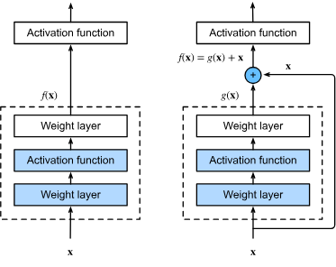
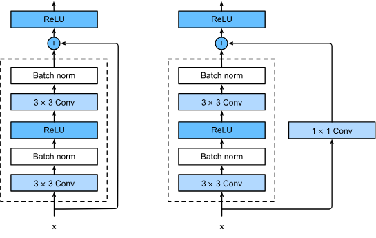
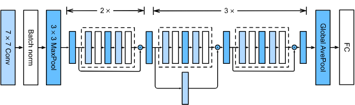

# Residual Networks

As we design deeper and deeper networks it should be intuitive that the
complexity and expressiveness of the network should increase.
But how do we make sure that the adding more layers actually makes the
networks more expressive rather than just different.

## Function Classes

A function class $\mathcal{F}$ is the set of all possible functions that a
specific network architecture can learn. The goal of training is to find
the function $f^*_{\mathcal{F}}$ that minimizes the Loss $L$ on the training data

$$f^*_\mathcal{F} \stackrel{\textrm{def}}{=} \mathop{\mathrm{argmin}}_f L(\mathbf{X}, \mathbf{y}, f) \textrm{ subject to } f \in \mathcal{F}$$

The problem is that if you design a new, large, or more complex network
architecture $\mathcal{F}'$, you intuitively expect it to find a "better" solution
($f^*_{\mathcal{F}'}$ is closer to $f^*$)
than the previous architecture ($\mathcal{F}$)

But if the function classes are non-nested ($\mathcal{F} \not\subseteq \mathcal{F}'$),
there is no guarantee that increasing model complexity
(i.e., increasing the size of $\mathcal{F}$) will improve the result.

In fact The optimal function
$f^*_{\mathcal{F}'}$ in the new class could actually be further away from the true function
$f^*$ than $f^*_{\mathcal{F}}$ was.

Notice this illustration, the star above each of the two is the optimal function, notice how on the left as we increase the size i.e. the complexity
of the function class it gets further away from $f^*$, but on the right
when we require nested function classes, it is guaranteed that we go
closer and closer to $f^*$ as the complexity increase.

To apply this concept to deep neural networks, if we train any layer
to be the _identity function_, the new, deeper model is guaranteed to be
at least as effective as the original, shallower model.

This reasoning led to the invention of the _Residual Network_ (ResNet),
where the core component is the residual block.

## Residual Blocks

Consider a local portion of a neural network. Denoting the input by
$x$, the regular approach (on the left) requires the series of layers
within the dotted box to directly learn the mapping $f(x)$.

In contrast, the residual block (on the right) the dotted-line box needs to
learn the _residual mapping_ $g(x) = f(x) - x$ The final output of the block is then:
$$f(\mathbf{x}) = g(\mathbf{x}) + \mathbf{x}$$

This is where the term residual block originates.
The line that carries the input $\mathbf{x}$ directly to the addition
operator is known as a residual connection or shortcut connection.

In fact you can thing of residual blocks as a special case of multi-branch
inception block: it has two brances one of them is the identity mapping.

ResNet has VGG's full $3\times 3$ convolutional layer design.
The residual block has two $3\times 3$ convolutional layers with the same number of output channels.
Each convolutional layer is followed by a batch normalization layer and a ReLU activation function.
Then, we skip these two convolution operations and add the input directly before the final ReLU activation function.

If we want to change the number of channels, we need to introduce an additional $1\times 1$ convolutional layer to transform the input into the desired shape for the addition operation.

## ResNet Model

The full architecture follows a consistent pattern,
similar to GoogLeNet:

1. Initial Layers (Stem):
   The model begins with a $7 \times 7$ convolutional layer with 64 output
   channels and a stride of 2,
   immediately followed by a $\mathbf{3 \times 3}$
   max-pooling layer with a stride of 2.
   Crucially, a Batch Normalization layer is added after each convolutional layer.

2. Modules:
   Unlike GoogLeNet,
   which uses Inception blocks,
   ResNet employs four primary modules composed of repeated residual blocks.
   The number of channels is typically doubled in the first block of each subsequent module
   (e.g., from 64 to 128).
   Concurrently,
   the first residual block in each subsequent module uses a stride of 2 to halve the height and width of the input representation.
   This downsampling is achieved by setting strides=2 within a residual block that uses a $\mathbf{1 \times 1}$ convolution for dimension matching.

3. Head:
   The architecture concludes with a Global Average Pooling layer,
   followed by a fully connected layer for classification.
   A common configuration, ResNet-18,
   consists of four convolutional layers in each of the four modules
   (excluding $\mathbf{1 \times 1}$ convolutions),
   plus the initial $7 \times 7$ layer and the final fully connected layer,
   totaling 18 layers.
   ResNet's overall structure is simpler and easier to modify than GoogLeNet's,
   contributing to its rapid adoption.

