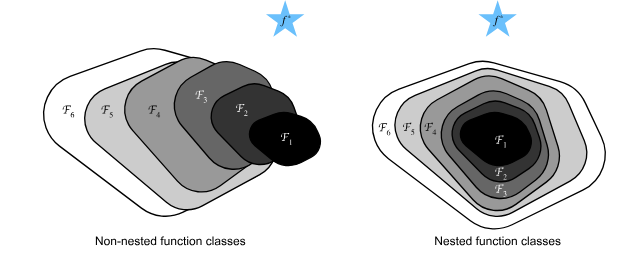

# Residual Networks

As we design deeper and deeper networks it should be intuitive that the
complexity and expressiveness of the network should increase.
But how do we make sure that the adding more layers actually makes the
networks more expressive rather than just different.

## Function Classes

A function class $\mathcal{F}$ is the set of all possible functions that a
specific network architecture can learn. The goal of training is to find
the function $f^*_{\mathcal{F}}$ that minimizes the Loss $L$ on the training data

$$f^*_\mathcal{F} \stackrel{\textrm{def}}{=} \mathop{\mathrm{argmin}}_f L(\mathbf{X}, \mathbf{y}, f) \textrm{ subject to } f \in \mathcal{F}$$

The problem is that if you design a new, large, or more complex network
architecture $\mathcal{F}'$, you intuitively expect it to find a "better" solution
($f^*_{\mathcal{F}'}$ is closer to $f^*$)
than the previous architecture ($\mathcal{F}$)

But if the function classes are non-nested ($\mathcal{F} \not\subseteq \mathcal{F}'$),
there is no guarantee that increasing model complexity
(i.e., increasing the size of $\mathcal{F}$) will improve the result.

In fact The optimal function
$f^*_{\mathcal{F}'}$ in the new class could actually be further away from the true function
$f^*$ than $f^*_{\mathcal{F}}$ was.

Notice this illustration, the star above each of the two is the optimal function, notice how on the left as we increase the size i.e. the complexity
of the function class it gets further away from $f^*$, but on the right
when we require nested function classes, it is guaranteed that we go
closer and closer to $f^*$ as the complexity increase.

To apply this concept to deep neural networks, if we train any layer
to be the _identity function_, the new, deeper model is guaranteed to be
at least as effective as the original, shallower model.

This reasoning led to the invention of the _Residual Network_ (ResNet),
where the core component is the residual block.
