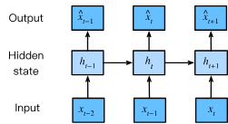

# Working with sequences

**Sequential data** differs from independent observations in that elements
withing a sequence are related.
We assume entire sequences are sampled independently from some distribution
just like individual inputs,
but the data arriving at each time step can't be independent.

This should come as not surprise.
If we did not believe that the elements in a sequence were related,
we would not have bothered to model them a sequence in the first place.

## Autoregressive Models

Before introducing a specialized neural networks designed to handle
sequentially structured data,
we should build some intuitions on actual sequence data.
Let's focus on a time-dependent signal,
such as the price, $x_t$,
of the FTSE 100 index observed at each time step $t \in \mathbb{Z}^+$.

A simple task for a trader is to forecast the index's movement
by estimating the probability distribution of the subsequent price, conditioned on the history of the observations.

$$P(x_t \mid x_{t-1}, \ldots, x_1)$$

It's often simpler to estimate the _conditional expectation_ rather than estimating the full distribution.

$$\mathbb{E}[(x_t \mid x_{t-1}, \ldots, x_1)]$$

A simple and natural strategy to estimate this is to apply
a regression model where the target is $x_t$ is regressed
against it's own previous values.
Models that utilize past values of a signal to predict its future value are known
as autoregressive models.

A significant obstacle arises when applying standard fixed-input models
to this problem:
the number of inputs,
$\{x_{t-1}, \ldots, x_1\}$, varies with time $t$.

There's Two main strategies to manage this:

1. **Fixed-Lenght Conditioning Window** :
   Simply assume that the far-reaching history is less relevant than the recent past.
   we limit the dependece to a fixed-length window $\tau$

2.**Latent Autoregressive Models**:
The second strategy involves developing models that maintain a fixed-size summary of the past.  
This summary is represented by a latent variable $h_t$.

- Prediction: The prediction of the next value, $\hat{x}_t$,
  is based on this summary: $\hat{x}_t = P(x_t \mid h_{t})$.
- Update: The summary itself is updated at each time step
  based on the previous summary and the last observed value: $h_t = g(h_{t-1}, x_{t-1})$.

## Sequence Models

A _Sequence Model_ is a function designed to estimate the joint probability
of an entire sequence of discrete tokens, such as words in a sentence.

This is a common and critical task in Natural Language Processing (NLP),
where these functions are specifically termed Language Models.
The field of sequence modeling is so dominated by NLP that
the terms are often used interchangeably, even for non-language data.

Language models are invaluable because they allow us to:

- Evaluate Likelihood: Calculate how natural or probable a given sequence is.
  This helps compare candidate outputs from systems like machine translation or speech recognition.

- Sample Sequences: Generate entirely new,
  coherent sequences of tokens (text generation).

- Optimize: Find the most likely sequence given a certain context.

While it seems that the estimating the joint probability
is not an autoregressive problem,
but mathematically predicting the probability of the entire sequence is equivalent to predicting the probability of _each_
subsequent token based on all the tokens that came before it.

$$P(x_1, \ldots, x_T) = P(x_1) \prod_{t=2}^T P(x_t \mid x_{t-1}, \ldots, x_1)$$

So for a discrete data like words, the autoregressive model must be
a _probabilistic classifier_ that outputs a full probability distribution
over the entire vocabulary for the next word.

### Makrov Models

While discussing the autoregressive models, we had the challenge of the non constant historical context.
To manage this, we make an assumption known as the
_Markov condition_

The **Markov condition** states that the future of a sequence
is conditionally independent of the distant past,
given the recent past.

If we assume that only the previous $\tau$
time steps ($\{x_{t-1}, \ldots, x_{t-\tau}\}$)
are necessary for prediction,
we say the sequence satisfies a Markov condition.
The Order of a Markov model equals $\tau$.

In reality, especially with text,
the Markov condition is only an approximation
(e.g., long-range dependencies are ignored).

However, employing this approximation,
even when we know it's not strictly true,
simplifies the computational and statistical problems significantly.
This is why even modern, complex language models
(like RNNs and Transformers) often limit the context window to thousands of words.

For discrete data, a true Markov model is simple:
it estimates the conditional probability
$P(x_t \mid x_{t-1})$
by merely counting the relative frequencies of word pairs
(or $k$-tuples) in the training data.

### The Order of Decoding

When factorizing the joint probability $P(x_1, \ldots, x_T)$,
we chose a left-to-right chain.
While a right-to-left faactorization is mathematically valid

The left-to right is preferred for several reasons:

1. Natural Intuition: It matches the direction in which
   text is read for most languages.

2. Causal Structure: For many types of data,
   especially those exhibiting causality
   (where the past influences the future),
   predicting in the forward direction is simply an easier modeling problem.
