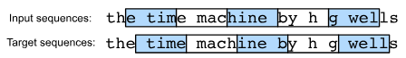

# Language Models

The goal of language models is to estimate the joint probability of the whole sequence:

$$
P(x_1,x_2,\dots x_T)
$$

The best model would write natural text by itself, word by word, unlike a random typewriter monkey.
It would even hold a good conversation based on what was said before.
But we don't have this perfect system yet
because it would need to truly _understand_ the words,
not just make them sound right.

Even the models we have now are useful.
For example, in speech recognition,
a computer might confuse things that sound alike,
like "recognize speech" and "wreck a nice beach."
The language model can tell the second one is silly and wrong.
Also, it knows that "dog bites man"
happens more often than "man bites dog,"
and it can tell the difference between the scary
"I want to eat grandma" and the okay request,
"I want to eat, grandma."

## Learning Language Models

We use the basic probability rule to expand the joint probability:

$$P(x_1, x_2, \ldots, x_T) = \prod_{t=1}^T P(x_t \mid x_1, \ldots, x_{t-1})$$
For example,
$P(\textrm{deep}, \textrm{learning}, \textrm{is}, \textrm{fun})$
would break down as:

$$
P(\textrm{deep}) \times P(\textrm{learning} \mid \textrm{deep}) \times P(\textrm{is} \mid \textrm{deep}, \textrm{learning}) \times P(\textrm{fun} \mid \textrm{deep}, \textrm{learning}, \textrm{is})
$$

### Markov Models and $n$-grams

Recall [Markov channel](./01_working_with_sequences.md)
Let's apply Markov models to language modeling.

Here the Markov property of first order would come in handy,
by assuming that the next token only depends on the one word before it.
It forgets everything else that came earlier.
$P(x_{t+1} \mid x_t, \ldots, x_1) \approx P(x_{t+1} \mid x_t)$

Higher orders (second, third, etc.) mean the dependence is on a longer, but still limited, number of previous words,
This leads to $n$-gram$ models:

$$
\begin{aligned}
   P(x_1, x_2, x_3, x_4) &=  P(x_1) P(x_2) P(x_3) P(x_4) \Rightarrow \text{unigram}\\
   P(x_1, x_2, x_3, x_4) &=  P(x_1) P(x_2  \mid  x_1) P(x_3  \mid  x_2)
P(x_4  \mid  x_3)\Rightarrow \text{bigram}\\
   P(x_1, x_2, x_3, x_4) &=  P(x_1) P(x_2  \mid  x_1)
P(x_3  \mid  x_1, x_2) P(x_4  \mid  x_2, x_3) \Rightarrow \text{trigram}
\end{aligned}
$$

To calculate these probabilities, we use _relative frequency_
from a large text corpus.
For instance,
$\hat{P}(\textrm{learning} \mid \textrm{deep}) = \frac{n(\textrm{deep, learning})}{n(\textrm{deep})}$
, where $n(\cdot)$ is the count of the sequence.

### Laplace Smoothing

Many word combinations (especially 3-words and more)
appear so rarely in the training data that their count $n(\dot)$ is zero.
Which prevents us from using them in the model.

_Laplace smoothing_ adds a small constant $\epsilon$ to all counts,
ensuring every sequence has a nonzero probability.language
$m$ here is the total number of unique words.

$$
   \begin{aligned}
       \hat{P}(x) & = \frac{n(x) + \epsilon_1/m}{n + \epsilon_1}, \\
       \hat{P}(x' \mid x) & = \frac{n(x, x') + \epsilon_2 \hat{P}(x')}{n(x) + \epsilon_2}, \\
       \hat{P}(x'' \mid x,x') & = \frac{n(x, x',x'') + \epsilon_3 \hat{P}(x'')}{n(x, x') + \epsilon_3}.
   \end{aligned}
$$

Here $\epsilon_1$, $\epsilon_2$, and $\epsilon_3$ are _hyperparameters_.
Take $\epsilon_1$ as an example, $\epsilon_1 = 0$, no smoothing is applied;
when $\epsilon_1$ approaches infinity, the probability approaches $1/m$.

But $n$-grams are still limited:

- Rarity: Many $n$-grams are still too rare for simple smoothing to work well.
- Storage: We must store all counts, which becomes huge quickly.Meaning Ignored:
  It treats "cat" and "feline" as completely unrelated;
  it ignores the meaning of words.
- Novel Sequences: Long sequences are often novel,
  and a model based only on previously seen frequency will perform poorly.

Thus we will shift our focus to neural networks for language modeling.

## Perplexity

To judge a language model, we measure how _surprising_ the text it predicts is.
A good language model is able to predict, with high accuracy,
the tokens that come next.
Consider the following continuations of the phrase
"It is raining":

1. "It is raining outside", Good model.
2. "It is raining banana tree", Nonsensical, but learning to spell.
3. "It is raining pojIHGL:HJOIO llosiho", Poorly trained; doesn't fit the data

We might measure the quality of the model by computing the likelihood
of the sequence.
But this is a number that is hard to understand and difficult to compare.
Especially that short sequences are much more likely to occur than the longer ones.

Information theory comes handy here. A good language model should accuratly
predict the next token based on the current tokens,
Information theory tells us that accurate prediction is directly related tokens
efficient data compression.
Therefore a better model is the one that allows us to spend fewer bits.

This quantity is the cross-entropy loss introduced in [SoftMax regression](/2_classification/softmax_regression.md),
we take the average over all tokens:

$$\frac{1}{n} \sum_{t=1}^n -\log P(x_t \mid x_{t-1}, \ldots, x_1)$$

This makes the performance on documents of different lengths comparable.
For historical reasons, scientists in NLP prefer to use a quantity called
_perplixity_. In a nutshell, it's the exponential of the average cross-entropy

$$\exp\left(-\frac{1}{n} \sum_{t=1}^n \log P(x_t \mid x_{t-1}, \ldots, x_1)\right)$$

Perplixity can be though of as the reciprocal of the geometric mean of
the number of real choices we have when picking the next token.

- Best Case (Perfect Model): Perplexity is 1. (The model always assigns
  probability 1 to the correct token).
- Worst Case: Perplexity is $\infty$ (positive infinity).
- Baseline (Uniform Model): Perplexity equals the number of unique tokens
  in the vocabulary. Any useful model must beat this baseline.

## Partitioning Sequences

We talked about measuring how good the model is, but we didn't explain
how the data is fed to the model in minibatches to the model while training.

Suppose that the dataset takes the form of a sequence of $T$ token indices in corpus.
We will partition it into subsequences, where each subsequence has $n$ tokens.
Firstly we should discard the first $d$ tokens where $d \lt n$,
the rest of the sequence is then partitioned into $m = \floor{(T-d)/n} subsequences.
Each subsequence will be used as an input sequence into the language model.

For language modeling,
the goal is to predict the next token based on the tokens we have seen so far;
hence the targets (labels) are the original sequence,
shifted by one token.

