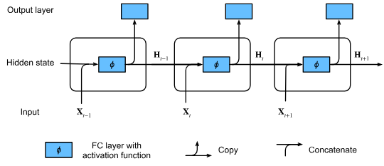

# Recurrent Neural Networks

RNNs are a class of neural networks designed specifically to process
sequential data.

## The Core Mechanism: Hidden State Recurrence

The key difference in an RNN is the recurrent calculation of the
hidden state $h_t$.
This mechanism allows info to persist from one time step to the next,
given the network a form of _memory_.

At any time step $t$, the hidden state $\mathbf{h}_t$
is computed as a function of the current input $\mathbf{x}_t$
and the hidden state from the previous time step

$$\mathbf{h}_t = \phi(\mathbf{W}_{xh} \mathbf{x}_t + \mathbf{W}_{hh} \mathbf{h}_{t-1} + \mathbf{b}_h)$$

Where $W_hh$ is the recurrent weight matrix for hidden to hidden connections

The output is based on the current hidden state:

$$\mathbf{o}_t = \mathbf{W}_{qh} \mathbf{h}_t + \mathbf{b}_q$$

This output is then ran through a softmax yielding probabilities.

## Data Preprocessing: One-Hot Encoding

For character or word-level language modeling, tokens(characters or words)
are first mapped to numerical indices.
These indices must be converted into a format suitable for neural network input
Which is One-Hot Encoding:

Each numerical numerical index $i$ is transformed into a vector $\mathbf{x} \in \mathbb{R}^N$,
where $N$ is the size of the vocabulary. This vector is all zeros except for the
$i$-th element, which is set to $1$.

## Gradient Clipping

The recursive multiplication of the recurrent weight matrix $W_{hh}$ during
gradient calculations while Back Propagation Thorough Time (BPTT)
can lead to **exploding gradients**.

To fix this we use **Gradient Clipping** which is a technique used to
stabilize training by limiting the maximum magnitude of the gradient vector.

In Gradient Descent, parameters are updated as $\mathbf{x} \gets \mathbf{x} - \eta \mathbf{g}$,
where $g$ is the gradient and $\eta$ is the learning rate.

When the gradient norm $g$ is excessively large, can become massive that
destabilizes the modeling

This could be solved by reducing the learn rate, but this slows down all the steps.
Instead, gradient clipping only projects the calculated gradient $g$ onto
a sphere of radius $\theta$

The clipped gradient $\mathbf{g}_{\text{clipped}}$ is calculated as:
$$\mathbf{g} \leftarrow \min\left(1, \frac{\theta}{\|\mathbf{g}\|}\right) \mathbf{g}$$

## Backpropagation Through Time

To understand BPTT,
you must first understand that an RNN processing a sequence is mathematically
identical to a very deep
**Feedforward Neural Network** (like an MLP) with one specific constraint:
**Shared Weights**.

- **Standard NN:** Layer 1 connects to Layer 2 with weights $W_1$. Layer 2 connects to Layer 3 with weights $W_2$.
- **RNN:** Time step 1 connects to Time step 2 using weights $W_{hh}$. Time step 2 connects to Time step 3 using the _exact same_ weights $W_{hh}$.

**"Unrolling"** means we visualize the loop in the RNN as a long chain
of repeated layers.
BPTT is simply applying the standard Chain Rule of Calculus to this unrolled chain.

---

### **2. The Simplified Math (Scalar Analysis)**

The text starts with a simplified scalar model (ignoring matrices) to build intuition about why gradients explode or vanish.

#### **The Forward Pass**

At any time $t$, we calculate a hidden state $h_t$ and an output $o_t$:
$$h_t = f(x_t, h_{t-1}, w_h)$$
$$o_t = g(h_t, w_o)$$

- $h_t$ depends on the current input $x_t$ AND the previous history $h_{t-1}$.
- The parameter $w_h$ is reused at every single step.

#### **The Backward Pass (The Gradient)**

We want to update the weight $w_h$ to minimize the total loss $L$. Because $w_h$ is used at _every_ time step, the total gradient is the sum of the gradients at each step:
$$\frac{\partial L}{\partial w_h} = \frac{1}{T} \sum_{t=1}^T \frac{\partial l_t}{\partial w_h}$$

**The Tricky Part:**
When calculating $\frac{\partial h_t}{\partial w_h}$ (how the state changes when weights change), we have a dependency loop.

1. Changing $w_h$ affects $h_t$ directly.
2. Changing $w_h$ _also_ affected $h_{t-1}$ (in the past), which in turn affects $h_t$.

The text uses the **Total Derivative** to express this:
$$\frac{\partial h_t}{\partial w_h} = \underbrace{\frac{\partial f}{\partial w_h}}_{\text{Direct effect}} + \underbrace{\frac{\partial f}{\partial h_{t-1}} \frac{\partial h_{t-1}}{\partial w_h}}_{\text{Effect from the past}}$$

#### **The "Exploding" Equation**

If you expand the recursive formula above (substituting $h_{t-1}$, then $h_{t-2}$, etc.), you get a summation of products:

$$\frac{\partial h_t}{\partial w_h} = \sum_{i=1}^{t-1} \left( \prod_{j=i+1}^{t} \frac{\partial f( \dots )}{\partial h_{j-1}} \right) \frac{\partial f( \dots )}{\partial w_h}$$

- **The Symbol $\prod$:** This means "product" (multiplication).
- **The Insight:** To calculate the gradient at time $t$ with respect to an input at time $i$ (way back in the past), you must multiply the partial derivatives of every time step in between.
- **The Result:** If those partial derivatives are numbers larger than 1 (e.g., 2), and the sequence is 100 steps long, you calculate $2^{100}$. The gradient **explodes**. If they are smaller than 1 (e.g., 0.5), you get $0.5^{100}$. The gradient **vanishes** (becomes zero).

---

### **3. Strategies for Calculation**

Since summing up that entire history is computationally expensive and unstable, the text proposes three strategies:

1. **Full Computation:**
   - Calculate the full sum for the entire sequence.
   - **Pros:** Exact gradient.
   - **Cons:** Very slow, high memory usage, likely to explode numerically.

2. **Truncated BPTT (Standard Practice):**
   - Cut off the sum after $\tau$ steps. You assume the gradient is zero past a certain point in history.
   - **Pros:** Stable, computationally efficient.
   - **Cons:** The model cannot learn dependencies longer than $\tau$ (e.g., if a word at the start of a paragraph changes the meaning of the last word, and $\tau$ is too short, the model won't learn it).

3. **Randomized Truncation:**
   - A theoretical method where the truncation length is a random variable.
   - **Pros:** Theoretically unbiased.
   - **Cons:** Adds "noise" (variance) to the training, making it slower to converge. The text notes this is rarely better than standard truncation.

---

### **4. BPTT in Detail (Matrix/Vector Math)**

The text then shifts to the formal linear algebra definition used in real coding.

#### **The Variables**

- $\mathbf{x}_t$: Input vector.
- $\mathbf{h}_t$: Hidden state vector.
- $\mathbf{W}_{hx}$: Weights connecting Input $\to$ Hidden.
- $\mathbf{W}_{hh}$: Weights connecting Hidden $\to$ Hidden (The Recurrent weights).
- $\mathbf{W}_{qh}$: Weights connecting Hidden $\to$ Output.

#### **The Gradient of the Loss ($L$)**

We calculate gradients by moving backward through the graph (refer to **Fig. 3** in your text).

**1. Output Layer ($\mathbf{W}_{qh}$):**
This is easy. It looks just like a standard regression gradient. It depends only on the current time step's error.

**2. Hidden State ($\mathbf{h}_t$) - The Crucial Step:**
This gradient flows from two directions:

- From the **Output** at the current time (the error we just made).
- From the **Future** hidden state $\mathbf{h}_{t+1}$ (the error passing backward from the future).

The equation is:
$$\frac{\partial L}{\partial \mathbf{h}_t} = \underbrace{\mathbf{W}_{hh}^\top \frac{\partial L}{\partial \mathbf{h}_{t+1}}}_{\text{From Future}} + \underbrace{\mathbf{W}_{qh}^\top \frac{\partial L}{\partial \mathbf{o}_t}}_{\text{From Output}}$$

**3. The Hidden Weights ($\mathbf{W}_{hh}$):**
To find how to change the recurrent weights, we look at the recurrence relation expanded over time:

$$\frac{\partial L}{\partial \mathbf{h}_t} = \sum_{i=t}^T (\mathbf{W}_{hh}^\top)^{T-i} \mathbf{W}_{qh}^\top \frac{\partial L}{\partial \mathbf{o}_{T+t-i}}$$

**The Key Finding:** Look at the term $(\mathbf{W}_{hh}^\top)^{T-i}$.
This is the matrix power. We are multiplying the weight matrix by itself $T-i$ times.

- If the **eigenvalues** (the "magnitude" of the matrix) are $> 1$, the values grow exponentially (**Exploding Gradient**).
- If the eigenvalues are $< 1$, the values shrink exponentially (**Vanishing Gradient**).
