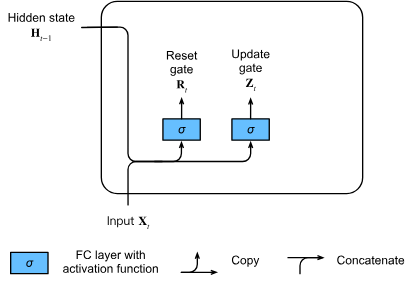
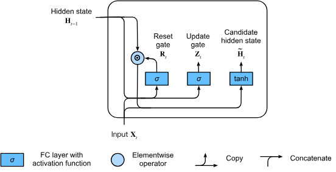

# Gated Recurrent Units (GRU)

The Gated Recurrent Units is another variation of the vanilla RNN architecture,
designed to address the vanishing gradient problem while improving the
computational efficiency than LSTM network.
GRU achieves state management using only **two gates**
The **Reset Gate** and the **Update Gate** and combines the hidden state and
cell state into a single vector.

## Reset Gate and Update Gate

Similar to LSTM, GRU both gates are calculated using the current input
$X_t$ and the previous hidden state $H_{t-1}$ passed through a sigmoid
function, forcing their values to lie in the range $(0,1)$

1. **Reset Gate**: Controls how the previous hidden state
   $H_{t-1}$ is combined with the current input when calculating the
   _candidate_ state. A value near 0 suggests $H_{t-1}$ should be ignored.

   $$\mathbf{R}_t = \sigma(\mathbf{X}_t \mathbf{W}_{\textrm{xr}} + \mathbf{H}_{t-1} \mathbf{W}_{\textrm{hr}} + \mathbf{b}_\textrm{r})$$

2. **Update Gate**: Controls how much of the previous hidden state $H_{t-1}$
   should be retained and how much of the new candidate state $\bar{H_t}$ should
   be adopted. A value near 1 means retaining the old state (memory).

   $$\mathbf{Z}_t = \sigma(\mathbf{X}_t \mathbf{W}_{\textrm{xz}} + \mathbf{H}_{t-1} \mathbf{W}_{\textrm{hz}} + \mathbf{b}_\textrm{z})$$

## Candidate Hidden state

The **Candidate Hidden state** ($\tilde{\mathbf{H}}_t$) represents a
potential new state of the network, calculated from the current input
$X_t$, with the Reset Gate $R_t$:

$$\tilde{\mathbf{H}}_t = \textrm{tanh}(\mathbf{X}_t \mathbf{W}_{\textrm{xh}} + (\mathbf{R}_t \odot \mathbf{H}_{t-1}) \mathbf{W}_{\textrm{hh}} + \mathbf{b}_\textrm{h})$$

The term $\mathbf{R}_t \odot \mathbf{H}_{t-1}$ determines which parts of
the past hidden state are relevant for calculating the current candidate state.
If an element in $\mathbf{R}_t$ is close to 0,
the corresponding part of the previous hidden state
$\mathbf{H}_{t-1}$ is reset (ignored).
This allows $\tilde{\mathbf{H}}_t$
to focus entirely on the current input and ignore irrelevant history.

The tanh function is used to scale the potential new information to the range
$(-1 ,1)$

## Hidden State Update

The final hidden state $H_t$ is computed using the update gate $Z_t$ to
interpolate between the old hidden state and the new candidate hidden state:

$$\mathbf{H}_t = \mathbf{Z}_t \odot \mathbf{H}_{t-1} + (1 - \mathbf{Z}_t) \odot \tilde{\mathbf{H}}_t$$

- The term $\mathbf{Z}_t \odot \mathbf{H}_{t-1}$ is the retention component.
  If an element of $\mathbf{Z}_t$ is close to 1,
  the corresponding information from the old state $\mathbf{H}_{t-1}$ is preserved.

- The term $(1 - \mathbf{Z}_t) \odot \tilde{\mathbf{H}}_t$ is the new information component.
  If an element of $\mathbf{Z}_t$ is close to 0,
  the corresponding information from the new candidate
  $\tilde{\mathbf{H}}_t$ is adopted (since $1 - 0 = 1$).

  
