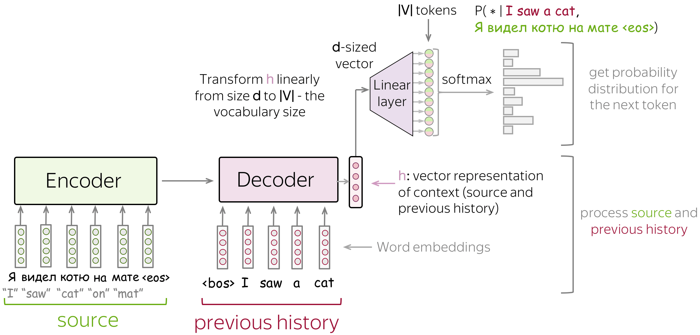

# Sequence to Sequence

RNNs was a major advance in the applied field of statistical
_machine translation_. Here, the model is presented with a sentence
in one language and must predict the corresponding sentence in another.
Note that here the sentences may be of different lengths, and that
corresponding words in the two sentences may not occur in the same
order.

Many problems have this flavor of mapping between two such "unaligned" sequences.
Such problems are called _sequence-to-sequence_ (seq2seq) problems.

## Creating The Dataset

To begin we download an example dataset (English-French dataset),
where each line is a tab-delimited pair of an English text(source)
and the translated French sequence (the target).

```text
Go.         Va !
Hi.         Salut !
Run!        Cours !
Run!        Courez !
Who?        Qui ?
Wow!        Ça alors !
```

First we pre-process the data by removing non-breaking spaces with spaces and converting everything to lowercase.

The next step is _Tokenization_, unlike the character-level tokenization in the previous sections,
for machine translation we prefer word-level tokenization
(although today's state of the art use more complex tokenization).
Our tokenizer only tokenizes the first `max_examples` sequence pairs.
We append the special "<eos>" token to the end of every sequence to indicate the end of the sequence.

After this to process minibatches of a text sequence we can _truncate_ and _pad_ the sequence.
suppose that every sequence in the same minibatch should have the same length `num_steps`.
So if a text sequence has fewer than `num_steps` tokens, we will append the special
`<pad>` token until it reaches `num_steps`. Otherwise, we will truncate the text sequence
by taking it's first `num_steps` tokens and discarding the remaining.

## The Encoder-Decoder Architecture

In the _sequence-to-sequence_ problems such as machine translation,
where inputs and outputs each consist of variable-length unaligned sequence,
we generally rely on _encoder-decoder_ architecture, where both of them are
implemented as RNNs.

Here, the _encoder_ RNN will take a variable-length sequence as input and
transform it into fixed-shape hidden state via (an embedding layer).

Then to generate the output sequence, one token at a time, the decoder model,
consisting of a separate RNN, will predict each successive target token
given both the input sequence and the preceding tokens in the output.



The special `<eos>` tokens marks the end of the sequence. Our model can stop making
predictions once this token is generated.

### Teacher Forcing

In a standard sequence generation process, the decoder produces its output one
token at a time.
And the input for the next time step is the token that the decoder predicted at the
current time step.

However during training, if the decoder makes a mistake early in the sequence,
that mistake is fed back as the input for the next step,
potentially compounding errors and confusing the training process.

The most common approach to fix this is called _teacher forcing_.

Teacher forcing fixes this instability by feeding the decider the correct token from
the target sequence at every time step,
regardless of what the decoder actually predicted.
This _Teacher_ (the ground truth target sequence) forces the network to follow the
correct path, ensuring that the model's states are always updated based on
accurate context.


### Encoder

The _Encoder_ reads a variable-length sequence and converts it into a single,
fixed-length vector known as the **Context Vector** $c$.

Consider a single sequence example. Suppose the input sequence is
$x_1, x_2, \ldots, x_T$ such that $x_t$ is the $t^{th}$ token.
At time step $t$, the RNN
transforms the input feature vector $\mathbf{x}_t$ for $x_t$
and the hidden state $\mathbf{h} _{t-1}$ from the previous time
step into the current hidden state $\mathbf{h}_t$.

And the encoder transforms the hidden states at all time steps into a context variable.

In this example, we use a unidirectional RNN to design the encoder,
we can also construct encoders using bidirectional RNNs.

> Note: we use an embedding layer to obtain the feature vector for each token
> in the input sequence.

> **The Embedding layer** maps each unique token ID in the input vocabulary
> to a corresponding high-dimensional vector.
> These vectors are learned during training to capture semantic and syntactic information.

### Decoder

The _Decoder_ takes the context vector from the encoder and generates the
output sequence one token at a time.
To predict the subsequent token in the target sequence, the RNN decoder takes
the previous step's target token ${y'}_t$, the hidden RNN state from the previous
step and the context variable $c$ as its input, and transforms them into the
hidden state ${s'}_t$ at the current time step.

After obtaining the hidden state of the decoder, we can use an output layer and
a softmax operation to compute the predictive distribution.

When implementing the decoder as follows, we directly use the hidden state at
the final time step of the encoder to init the hidden state of the decoder.
This requires that the RNN encoder and the RNN deecoder have the same number of
layers and hidden units.

### Loss Masking

To handle the special tokens (`<pad>`) and make sure that thy don't influence the
training process and skewing the gradients, we apply a sequence mask.
This mask assigns a weight of zero to all irrelevant entries in the loss calculations
, effectively ignoring them.

### Evaluating Sequence Quality: The BLEU Score

When a model generates a predicted sequence and we have a corresponding target
sequence, the appropriate measure for quantifying the similarity between these two
sequences:

The **Bilingual Evaluation Understudy (BLEU)** score is the standard measure for
assessing the quality of output sequences in various NLP applications.

In principle, BLEU evaluates the quality of a predicted sequence by checking how
many of its $n$-grams (subsequences of $n$ tokens) appear in the target sequence.

Let $\textrm{len}_{\textrm{label}}$ and $\textrm{len}_{\textrm{pred}}$
be the number of tokens in the target sequence and the predicted sequence, respectively.
The BLEU score is formally defined as:

$$
\text{BLEU} = \exp\left(\min\left(0, 1 - \frac{\textrm{len}_{\textrm{label}}}{\textrm{len}_{\textrm{pred}}}\right)\right) \prod_{n=1}^k p_n^{1/2^n}
$$

Where $k$ is the longest $n$-gram considered for matching.

Whenever the predicted sequence is identical to the target sequence,
all $p_n$ values are 1, and the penalty term is $\exp(0) = 1$,
resulting in a perfect BLEU score of 1.

The leading exponential term,
$\exp\left(\min\left(0, 1 - \frac{\textrm{len}_{\textrm{label}}}{\textrm{len}_{\textrm{pred}}}\right)\right)$,
is the brevity penalty. This factor addresses the issue that shorter predicted
sequences often yield deceptively higher $p_n$ values.
