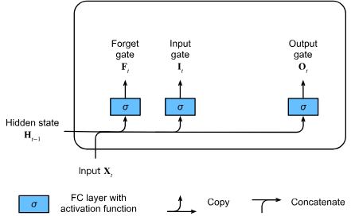

# Long Short-Term Memory (LSTM)

After the first RNNs were trained the problems of long-term dependencies
became clear very quickly because of vanishing and exploding gradients.
While gradient clipping helps with exploding gradients, handling vanishing
gradients appears to require a more elaborate solution.

One of the first and most successful techniques for addressing This problem
was Long Short-Term Memory model.

LSTMs resemble standard RNNs but each recurrent node is replaced by a
memory cell. Each memory cell contains an internal state.

The name Long Short-Term Memory arises from contrasting the three types of "memory" within a neural network:

1. **Long-Term Memory (Weights)**:
   This refers to the network's **parameters** (weights and biases).
   These values change slowly over the course of the entire training process and encode the general,
   persistent knowledge about the dataset and task (e.g., grammar rules, word relationships).

2. **Short-Term Memory (Activations):**
   This refers to the **ephemeral activations** that flow as the hidden state
   ($\mathbf{h}_t$)
   from one time step to the next in a simple Recurrent Neural Network (RNN).
   This memory is unstable and suffers from the **vanishing gradient problem**,
   causing it to quickly "forget" information from more than a few steps in the past.

3. **Intermediate Memory (The Memory Cell):**
   The LSTM model introduces a dedicated,
   intermediate type of storage called the **Memory Cell**
   (or **Cell State**, $\mathbf{C}_t$).
   This cell acts as a **conveyor belt** that runs across the entire sequence,
   allowing information to pass through unchanged,
   thereby preserving knowledge over long durations.

The Memory Cell is regulated by *multiplicative nodes\*\* known as*gates\*.
These gates are what gives LSTM it's power.

## Gated Memory Cell

Each Memory cell is equipped with an internal state and a number of multiplicative gates
that determine whether

1. A given input should impact the internal state (the input gate)
2. The internal state should be flushed to
   (the forget gate)
3. The internal state of a given neuron should be allowed to impact the cell’s
   output (the output gate).

### Gated Hidden State

The core advancement of the LSTM over the standard RNN lies in the
ability to gate the hidden state.
This means the model learns dedicated,
context-dependent mechanisms to control when information should be:

1. **Updated**: Determining how much of the current input contributes to the
   persistent memory.

2. **Retained/Flushed:** Determining how much of the previous memory should be
   kept or reset to 0.

3. **Outputted:** Determining when the memory should be allowed to influence
   the network's final output.

These learned mechanisms allow LSTMs to selectively skip irrelevant
temporary observations or retain critical information from the distant past
(e.g., the first token of a sequence) for hundreds of time steps.

### Input, Forget, and Output Gates

Three fully connected layers with sigmoid activation functions compute all the
values of the input, forget, and output gate.
The sigmoid ensures that the output values are in the range $(0,1)$,
acting like *switches*.
Additionally, we require an *input node*, typically computed with a *tanh* activation function.

The inputs to all gates are the current input ($\mathbf{X}_t$) and the previous hidden state ($\mathbf{H}_{t-1}$).

| Gate                             | Role                                                                                                        | Equation                                                                                                                           |
| :------------------------------- | :---------------------------------------------------------------------------------------------------------- | :--------------------------------------------------------------------------------------------------------------------------------- |
| **Input Gate ($\mathbf{I}_t$)**  | Determines how much of the new candidate input should be written to the cell state.                         | $\mathbf{I}_t = \sigma(\mathbf{X}_t \mathbf{W}_{\textrm{xi}} + \mathbf{H}_{t-1} \mathbf{W}_{\textrm{hi}} + \mathbf{b}_\textrm{i})$ |
| **Forget Gate ($\mathbf{F}_t$)** | Determines how much of the previous memory cell state ($\mathbf{C}_{t-1}$) should be kept.                  | $\mathbf{F}_t = \sigma(\mathbf{X}_t \mathbf{W}_{\textrm{xf}} + \mathbf{H}_{t-1} \mathbf{W}_{\textrm{hf}} + \mathbf{b}_\textrm{f})$ |
| **Output Gate ($\mathbf{O}_t$)** | Determines how much of the final (gated) cell state should be exposed as the hidden state ($\mathbf{H}_t$). | $\mathbf{O}_t = \sigma(\mathbf{X}_t \mathbf{W}_{\textrm{xo}} + \mathbf{H}_{t-1} \mathbf{W}_{\textrm{ho}} + \mathbf{b}_\textrm{o})$ |

### Input Node

Before updating the memory cell, a candidate for the new information is computed,
known as the **Input Node**
(or **Candidate Cell State**), $\tilde{\mathbf{C}}_t$.
This calculation is similar to the gate calculations but uses the hyperbolic tangent function
($\tanh$)
as the activation, which squashes the values into the range
$(-1, 1)$:

$$\tilde{\mathbf{C}}_t = \textrm{tanh}(\mathbf{X}_t \mathbf{W}_{\textrm{xc}} + \mathbf{H}_{t-1} \mathbf{W}_{\textrm{hc}} + \mathbf{b}_\textrm{c})$$

### Memory Cell Internal State

The input gat $I_t$ governs how much we take new data
into account via $C_t$ and the forget gate $F_t$ addresses
how much of the old cell internal state $C_{t-1}$
we retain.
Using the Hadamard product operator we arrive at the following equation:

$$\mathbf{C}_t = \mathbf{F}_t \odot \mathbf{C}_{t-1} + \mathbf{I}_t \odot \tilde{\mathbf{C}}_t$$

- Retention: The $\mathbf{F}_t \odot \mathbf{C}_{t-1}$
  term selectively retains relevant information from the old state
  $\mathbf{C}_{t-1}$ (if $\mathbf{F}_t$ elements are near 1).
- Update: The $\mathbf{I}_t \odot \tilde{\mathbf{C}}_t$
  term selectively incorporates new candidate information
  $\tilde{\mathbf{C}}_t$ (if $\mathbf{I}_t$ elements are near 1).

This controlled additive flow is what allows the gradient
to flow without vanishing, as it avoids the
destructive chain of matrix multiplications.

### Hidden State

Finally we need to define how to compute the **Hidden State**
$H_t$,
which is the output visible to other layers, It's calculated
by gating the memory cell:

$$\mathbf{H}_t = \mathbf{O}_t \odot \tanh(\mathbf{C}_t)$$

First we apply tanh to the memory cell internal state
$C_t$ to
ensure it's values is in the range (-1,1)

Then the Output Gate determines which components of the filtered
memory cell are passed on to the rest of the network.

This design allows the memory cell to accumulate information across many time steps
(by keeping $\mathbf{F}_t \approx 1$ and $\mathbf{I}_t \approx 0$)
without immediately broadcasting it to the output ($\mathbf{O}_t \approx 0$).
It can then "release" this information at a later, relevant time step
(when $\mathbf{O}_t$ flips to $\approx 1$).

