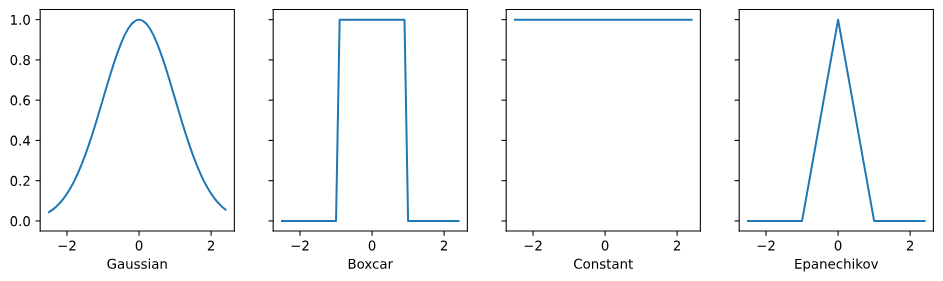
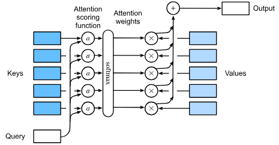
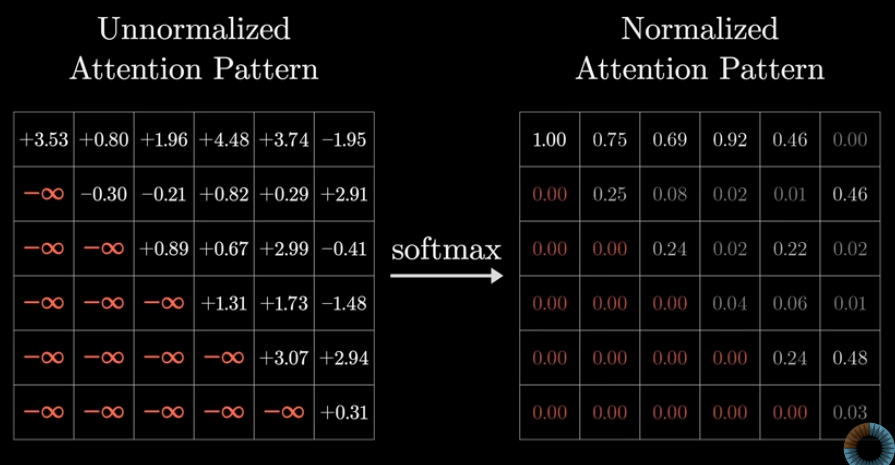

# Queries, Keys, Values, and Attention Scoring

So far all the networks we have reviewed relied on the input being of a
pre-defined constant size.
A CNN is constrained by its receptive field, and an RNN is constrained by
it's sequential nature.

This approach can lead to significant problems when the input is truly of
varying size with varying information content, such as the text translation
problem, in particular, for long sequences it becomes quite difficult to keep
track of everything that has already been generated or even viewed by the network.

## Attention Mechanism

To understand the attention mechanism, think of is as a database retrieval
system. In a traditional database, you have a set of keys $k$ paired with
values $v$.
When you provide a query $q$, the system finds the key that matches exactly
and returns the corresponding value.

We generalize this to _attention pooling_:

- **Query**: The item we are currently focusing on ("The seeker")
- **Keys**: The descriptors of all available items in the database
- **Values**: The actual information content associated with each key.

Unlike a hard database lookup, attention pooling computes a weighted average
of the values based on how well the query matches each key.

Let us assume we have a query $\mathbf{q} \in \mathbb{R}^{d_q}$
and $n$ key-value pairs $\{(\mathbf{k}_1, \mathbf{v}_1),
\dots, (\mathbf{k}_n, \mathbf{v}_n)\}$, where $\mathbf{k}_i \in \mathbb{R}^{d_k}$
and $\mathbf{v}_i \in \mathbb{R}^{d_v}$.
The attention pooling output is a weighted sum of the values:

$$
f(\mathbf{q}, (\mathbf{k}_1, \mathbf{v}_1), \dots, (\mathbf{k}_n, \mathbf{v}_n)) =
\sum_{i=1}^{n} \alpha(\mathbf{q}, \mathbf{k}_i) \mathbf{v}_i
$$

Where $\alpha(q,k_i)$ is the **attention weight** assigned to value $v_i$.
These weights are typically computed by passing the attention scoring function $\alpha(q,k_i)$ through a softmax operation.

But How does attention pooling differ from a standard FC layer?
The difference lies in where the _knowledge_ is stored:
FC simply stores the parameters in a weight matrix with a fixed size,
but these weights are learned during training and do not change based on
the specific input content during inference.

On the other hand, Attention pooling **dynamically compute** these "weights"
at runtime based on the relationship between the query and keys.
Some kinds of attention pooling has trainable parameters but the pooling
mechanism itself remains flexible.

## Attention Pooling by Similarity

Now that we have introduced the primary components of the attention mechanism,
let's use them in a rather classical setting, namely regression and classification
via kernel density estimation.

The most basic form of attention is Nadaraya-Watson estimators.
It estimates the output by taking a weighted average of
which rely on a _similarity kernel_ $\alpha(q,k)$
relating the queries to the keys.
Some common kernels are

$$
\begin{aligned}
\alpha(\mathbf{q}, \mathbf{k}) & = \exp\left(-\frac{1}{2} \|\mathbf{q} - \mathbf{k}\|^2 \right) && \textrm{Gaussian;} \\
\alpha(\mathbf{q}, \mathbf{k}) & = 1 \textrm{ if } \|\mathbf{q} - \mathbf{k}\| \leq 1 && \textrm{Boxcar;} \\
\alpha(\mathbf{q}, \mathbf{k}) & = \mathop{\mathrm{max}}\left(0, 1 - \|\mathbf{q} - \mathbf{k}\|\right) && \textrm{Epanechikov.}
\end{aligned}
$$

These simply measures the _distances_ between the key and the query in there
own way.

If we use a **Gaussian Kernel** We can write the prdiction formula with the
softmax operation:

$$f(x) = \sum_{i=1}^n \text{softmax}\left(-\frac{1}{2}(x - x_i)^2\right) y_i$$

> Intuition: The kernel acts as a "similarity scorer."
> If a key $x_i$ is far from the query $x$, the kernel gives it a low score.

The kernel could have different width, and by narrowing the kernel, the less
smooth the estimate. At the same time, it adapts better to the local variations.

## Attention Scoring Functions

In the last section we used distance based kernels. As it turns out distance functions are slightly more expensive to compute than alternatives
like dot products. Given that we're going to apply the softmax operation
anyway after this _attention scoring function_.

### Dot Product Attention

Let's revisit the Gaussian kernel attention function without the exponent:

$$
   a(\mathbf{q}, \mathbf{k}_i) = -\frac{1}{2} \|\mathbf{q} - \mathbf{k}_i\|^2  = \mathbf{q}^\top \mathbf{k}_i -\frac{1}{2} \|\mathbf{k}_i\|^2  -\frac{1}{2} \|\mathbf{q}\|^2.
$$

Notice three important points here:

- First, the final term $-\frac{1}{2} \|\mathbf{q}\|^2$ depends only on the
  query. So when we use the softmax this term affects every attention weight
  equally, so it's effectively cancels out.

- Second, The middle term $-\frac{1}{2} \|\mathbf{k}_i\|^2$ becomes constant
  when using batch or layer normalization (To be discussed later).

- Third, the term $\mathbf{q}^\top \mathbf{k}_i$ to control the variance
  and not cause problems when we feed this to the softmax function, we **scale** by dividing by $\sqrt d$ where $d$ is the variance.

$$
  a(q, k_i) = q^T k_i / \sqrt d
$$

### Convenience Functions

Here's some utility functions to handle real-world complications.

#### Masked Softmax Operation

One of the most popular applications of attention is in sequence models.
And to make batches we often pad shorter sequences with special tokens,
but we don't want these tokens to participate in our attention computation.

So we limit our attention sum to only the valid length for each sequence.

This is also used to make sure that next words attention does not influence
past words

#### Batch Matrix Multiplication

Another essential operation is multiplying batches of matrices efficiently.
When we have minibatches of queries, keys, and values, we need to perform many matrix multiplications in parallel.
This is straightforward in modern frameworks

### Additive Attention

What if queries and keys have different dimensions?
We could use a matrix transformation $q^T M k$,
but there's another elegant solution: **additive attention**.

$$a(\mathbf{q}, \mathbf{k}) = \mathbf{w}_v^\top \text{tanh}(\mathbf{W}_q \mathbf{q} + \mathbf{W}_k \mathbf{k})$$

where $\mathbf{W}_q \in \mathbb{R}^{h \times q}$, $\mathbf{W}_k \in \mathbb{R}^{h \times k}$, and $\mathbf{w}_v \in \mathbb{R}^h$ are learnable parameters.
