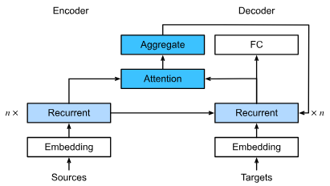
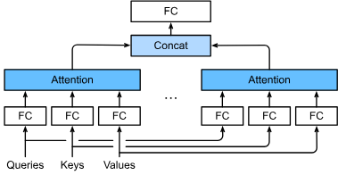
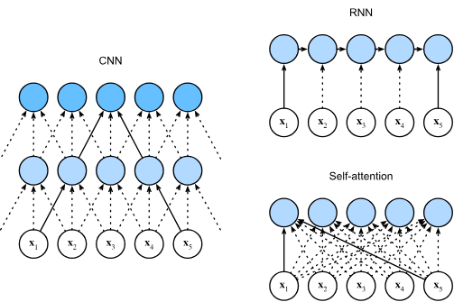

# Attention Mechanisms

## The Bahdanau Attention Mechanism

When we introduced the [seq2seq](/5_rnns/07_machine_translation.md)
model for machine translation.
A potential bottleneck in that architecture is that the encoder must compress the entire
source sequence into a single fixed-length vector (the context variable) to initialize
the decoder.
For Long sequences, this "information bottleneck" makes it difficult makes it difficult
for the decoder to access specific parts of the input.

To address this, Bahadanau proposed a mechanism that allows the decoder to attend to
different parts of the source sequence at each decoding step.

### Model Architecture

The key idea of Bahdanau attention is to replace the fixed context vector with a
time-varying context vector $c_t'$ that is updated at every decoding step $t'$.

At each decoding time step $t'$, the context vector $\mathbf{c}_{t'}$ is calculated
as the weighted sum (attention pooling) of all encoder hidden states (the values):

$$
  \mathbf{c}_{t'} = \sum_{t=1}^{T} \alpha(\mathbf{s}_{t'-1},
\mathbf{h}_t) \mathbf{h}_t
$$

where:

- $\mathbf{s}_{t'-1}$ is the decoder hidden state at the previous time step
  (the query).
- $\mathbf{h}_t$ is the encoder hidden state at time step $t$
  (both the key and the value).
- $\alpha$ is the attention weight, computed using the additive
  attention scoring function.

For the attention scoring we used **additive attention scoring**.

$$
a(\mathbf{q}, \mathbf{k}) = \mathbf{v}^\top \tanh(\mathbf{W}_q \mathbf{q} +
\mathbf{W}_k \mathbf{k})
$$

## Multi-Head Attention

In The previous section we used a single attention scoring function to compute
the relationship between queries and keys.
However, in practice, the same set of queries and keys might exhibit
multiple different types of relationships.

For example, in a natural languge sequence, one attention "head" might focus on capturing
long-range dependency, while another might focus on local syntactic structures.

To capture these diverse relationship, rather than performing a single attention
pooling, we can run our queries, keys, and values through independently learned
linear projection, Then these projected queries, keys, and values are fed into
attention pooling in parallel. In the end, attention pooling ouputs are concatenated
and transformed with another learned linear projection to produce the final output.
This is the core intuition behind **multi-head attention**, where each attention
pooling output is a _head_.

### Model Architecture

Given a query $\mathbf{q} \in \mathbb{R}^{d_q}$, a key $\mathbf{k} \in \mathbb{R}^{d_k}$,
and a value $\mathbf{v} \in \mathbb{R}^{d_v}$,
the multi-head attention output is computed by concatenating $h$ attention heads, followed by a linear transformation.
Each head $i$ ($i = 1, \dots, h$) is calculated as:

$$
\mathbf{h}_i = f(\mathbf{W}_i^{(q)}\mathbf{q}, \mathbf{W}_i^{(k)}\mathbf{k}, \mathbf{W}_i^{(v)}\mathbf{v}) \in \mathbb{R}^{p_v}
$$

Where:

- $\mathbf{W}_i^{(q)} \in \mathbb{R}^{p_q \times d_q}$, $\mathbf{W}_i^{(k)} \in \mathbb{R}^{p_k \times d_k}$,
  and $\mathbf{W}_i^{(v)} \in \mathbb{R}^{p_v \times d_v}$ are learnable parameters.

- $f$ is an attention pooling function,
  such as additive attention or scaled dot-product attention.

The final output is the concatenation of all heads,
projected back into the desired output dimension $p_o$:

$$\mathbf{W}_o \begin{bmatrix} \mathbf{h}_1 \\ \vdots \\ \mathbf{h}_h \end{bmatrix} \in \mathbb{R}^{p_o}$$

where $\mathbf{W}_o \in \mathbb{R}^{p_o \times h p_v}$ is a learnable linear transformation.

A naive implementation would involve $h$ separate linear layers for queries, keys, and values.
However, we can improve computational efficiency by using a single large linear layer and
then "splitting" the output into multiple heads using tensor reshaping and transpositions.

## Self-Attention and Positional Encoding

In previous sections, queries, keys, and values typically originated from different sources.
For instance, in the Bahdanau attention mechanism, the query is the decoder’s hidden state,
while the keys and values are the encoder’s hidden states.
In self-attention, all three components—queries, keys, and values—originate from the same input sequence.

Given an input sequence of tokens $\mathbf{x}_1, \dots, \mathbf{x}_n$, where each
$\mathbf{x}_i \in \mathbb{R}^d$, self-attention computes an output sequence
$\mathbf{y}_1, \dots, \mathbf{y}_n$ of the same length. Each output $\mathbf{y}_i$
is an attention pooling of all input tokens using $\mathbf{x}_i$ as the query:

$$
\mathbf{y}_i = f(\mathbf{x}_i, (\mathbf{x}_1, \mathbf{x}_1), \dots, (\mathbf{x}_n, \mathbf{x}_n)) \in \mathbb{R}^d
$$

### Comparing CNNs, RNNs, and Self-Attention

Let's compare architectures that map a sequence of length $n$ to another of equal
length (with dimension $d$). We evaluate them based on computational complexity,
sequential operations (blocking parallelism), and maximum path length (ease of
learning long-range dependencies).

| Layer Type     | Complexity Per Layer | Sequential Ops | Max Path Length |
| -------------- | -------------------- | -------------- | --------------- |
| Self-Attention | O(n^2d)              | O(1)           | O(1)            |
| RNN            | O(nd^2)              | O(n)           | O(n)            |
| CNN            | O(knd^2)             | O(1)           | O(n/k)          |

- **Self-Attention**: Every token is directly connected to every other token ($O(1)$ path),
  making it excellent for long-range dependencies.
  However, the $O(n^2)$ complexity makes it slow for very long sequences.
- **RNNs**: Process tokens one-by-one, preventing parallelization and making
  long-range dependencies harder to learn due to the $O(n)$ path.
- **CNNs**: Hierarchical structure allows for parallel computation,
  but capturing global information requires stacking many layers.

But unlike RNNs, self attention does not ditches sequential operations in favor
of parallel computation. It treats the sequence as a bag of words, it cannot
naturally distinguish the order of tokens
(e.g., "The dog bit the man" and "The man bit the dog" would result in the same internal representations).

The dominant approach for preserving information about the order of tokens is to represent this to the model as an additional input associated with each token.
These inputs are called **Positional Encoding** $\mathbf{X} + \mathbf{P}$, and they can either
be learned or fixed.

The most straightforward approach is to assign a unique signature to every position
$i \in \{0, 1, \dots, n-1\}$. If our embedding dimension is $d$, we want a vector
$P_i$ that is distinct for every $i$.

While we could simply use integers (1,2,3,...), this would lead to very large values
for long sequences, instead we use _sinusoidal encodings_.

$$p_{i, 2j} = \sin\left(\frac{i}{10000^{2j/d}}\right), \quad p_{i, 2j+1} = \cos\left(\frac{i}{10000^{2j/d}}\right)$$

where $i$ is the position index and $j$ is the dimension index.

So this has different frequencies for each dimension and different values for each position.

But Why Addition instead of Concatenation?

A common point of confusion is why we add the positional encoding to the word embedding
($\mathbf{X} + \mathbf{P}$) rather than concatenating them.

1. **Dimension Efficiency**:
   Concatenation would increase the input dimension,
   making the subsequent weight matrices larger and more computationally expensive.
2. **Feature Interaction**:
   When we add them, the query-key dot product $\mathbf{q}^\top \mathbf{k}$
   expands into four terms:

- (Content $\cdot$ Content)
- (Content $\cdot$ Position)
- (Position $\cdot$ Content)
- (Position $\cdot$ Position)

This allows the attention mechanism to weigh tokens based on their meaning,
their position, or a combination of both.
