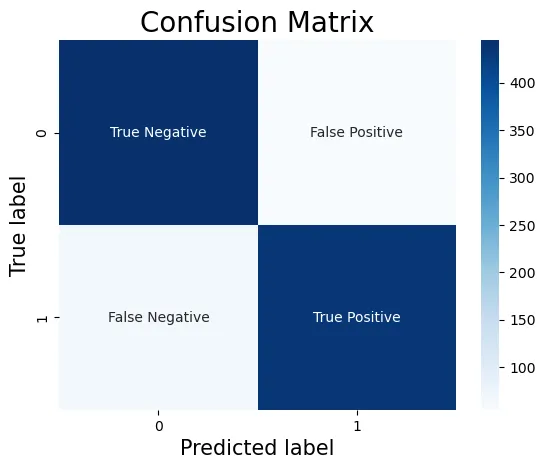

## Confusion Matrix 
Also known as the *error matrix* or *contingency table*, This is the fundemental tool in the evaluation of the performance of classification algorithms.

A confusion matrix is a table that summarizes the classification results of a binary classifier.
It provides a detailed analysis of the classification performance of a model by showing the number of:

- True Positive (TP): Correctly predicted positive cases
- True Negative (TN): Correctly predicted negative cases
- False Positive (FP): Incorrectly predicted as positive (Type I error)
- False Negative (FN): Incorrectly predicted as negative (Type II error)

## Accuracy 
Most common metric, measures the proportion of correct predictions made by the model out of all the predictions.

$$
\text{Accuracy}  = \frac{(TP + TN)}{(TP + TN + FP + FN)} 
$$

Accuracy can be a bit misleading with imbalanced datasets.

## Precision
Precision is a metric that measures the proportion of true positive (TP) instances among the instances that are predicted as positive by the model.

In other words, it measures the accuracy of positive predictions. 

$$ 
\text{Precision} = \frac{TP}{ (TP + FP)}
$$

This could be used when false positives are too costly like spam detection or fraud detection.

## Recall 
It measures the proportion of positive instances that are correctly identified out of all the actual positive instances.

It's also known as *sensitivity* or *true positive rate* 

$$
\text{Recall} = \frac{TP}{(TP + FN)}
$$

This is used when False negative's are too costly like medical diagnosis.

## F1 Score
F1-score is a performance metric that combines precision and recall.
By measuring the *harmonic mean* of them.

$$
\text{F1 Score} = 2\times \frac{\text{Precision} \times \text{Recal}}{\text{Precision} + \text{Recal}}
$$

## F1 Beta Score

This one is a generalized *F1 Score* with an adjustable weight $\beta$ to say which of the metrics is more important

$$
\text{F1-Beta} = (1 + β²) × \frac{Precision × Recall}{β² × Precision + Recall}
$$

- β = 1: Equal weight (same as F1)
- β > 1: Favors recall over precision
- β < 1: Favors precision over recall

## ROC-AUC Curve (Not Studied Yet C/P from LLM)
### ROC Curve

- Plots True Positive Rate (TPR) vs False Positive Rate (FPR) at various thresholds
- TPR = Recall = TP / (TP + FN)
- FPR = FP / (FP + TN)

### AUC (Area Under Curve)

- Single score summarizing ROC curve (range: 0-1)
- AUC = 1: Perfect classifier
- AUC = 0.5: Random classifier (diagonal line)
- Higher AUC: Better discrimination between classes
- Use when: Classes are imbalanced or need threshold-independent metric