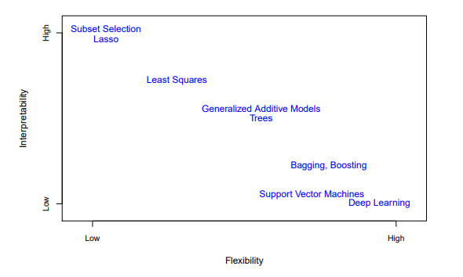

# Statistical Learning Basics

## Why Estimate $f$

For $f$ a function of the inputs $X_1 \dots X_p$, There are two main reasons that we may wish to estimate 

### Prediction
In many situations, a set of inputs are readily available,
but the output $Y$ cannot be easily obtained. Thus we can predict $Y$ using

$$
\hat{Y} = \hat{f}(X)
$$

Where $\hat{f}$ is our estimate for $f$.

The value of $\hat{Y}$ as a prediction depends on two quantities,
which we will call the *reducible error* and the *irreducible error*. 

In general the accuracy of $\hat{f}$ will not be a perfect estimate for $f$,
but we can potentially improve it,
thus this error is *reducible*.

However, even if it were possible to form a perfect estimate for $f$, our prediction will still have some error,
because the estimate is still a function of the noise.

### Inference 
Here we wish to estimate $f$ but our goal is not to make predictions.
In this setting we are interested in answering
- *Which predictors are associated with the response? I*

- *What is the relationship between the response and each predictor?*

- *Can the relationship between Y and each predictor be adequately summarized using a linear equation, or is the relationship more complicated?*

## How Do we estimate $f$ ?
We will always assume that we have observed a set of $n$ different data points. 
These are called *training data*.

Broadly speaking, most statistical learning methods for this task can be characterized as either *parametric* or *non-parametric*.

### Parametric Methods
This involves a two step model-based approach.

1. First, we make an assumbtion about the functional form, or shape of $f$, 
for example $f$ is linear
thus use a *linear model*

2. After a model has been selected, we need a procedure that uses training data to *fit*, or *train* the model.

In the case of a linear model, we need to find the values for weights and bias
such that it becoms the closest to $Y$

The disadvantage of a parametric approach is that the model we choose will not match the true form of $f$ most of the time.

### Non-Parametric Methods

These methods do not make explicit assumptions about the function form.
Instead they seek an estimate that gets as close to the data points as possible without being too rought or wiggly.

This completely avoids the danger that comes from not fitting the data if the 
function form used in estimating is very different from the true form.

But non-parametric approaches do suffer from a major
disadvantage: since they do not reduce the problem of estimating $f$ to a
small number of parameters, a very large number of observations (far more
than is typically needed for a parametric approach) is required in order to
obtain an accurate estimate for $f$.

## The Trade-Off Between Prediction Accuracy and Model Interpretability

### Flexibility vs Interpretability Spectrum

Methods vary in their **flexibility** - their ability to generate a wide range of shapes to estimate $f$:
- **Less flexible/restrictive**: Linear regression (can only generate linear functions)
- **More flexible**: Methods like thin plate splines (can generate a much wider range of shapes)

**Key insight**: As flexibility increases, interpretability generally decreases.

### When to Choose Less Flexible Methods

Despite having less flexibility, restrictive models are often preferable *For Inference Goals*. 
For instance, Linear models make it easy to understand the relationship between $Y$ and predictors $X_1, X_2, \dots, X_p$.

In Contrast, Highly flexible approaches (splines, boosting) can produce such complicated estimates that it becomes difficult to understand how individual predictors relate to the response

In some other settings, we are only intereseted in prediction, and the interpretabilty of the predictive model is simply not of intrest. 
We will often obtain more accurate predictions using
a less flexible method. This phenomenon, which may seem counterintuitive at first glance, has to do with the potential for overfitting in highly
flexible methods.

### Supervised vs Unsupervised Learning

Most statistical learning problems fall into one of two categories: **supervised** or **unsupervised**.

### Supervised Learning

For each observation of the predictor measurement(s) $x_i, i = 1, \dots, n$, there is an associated response measurement $y_i$.

**Goal**: Fit a model that relates the response to the predictors, with the aim of:
- Accurately predicting the response for future observations (**prediction**), or
- Better understanding the relationship between the response and the predictors (**inference**)

**Examples of supervised methods**:
- Linear regression
- Logistic regression
- Generalized Additive Models (GAMs)
- Boosting
- Support Vector Machines

### Unsupervised Learning

For every observation $i = 1, \dots, n$, we observe a vector of measurements $x_i$ but **no associated response** $y_i$.

**Key characteristic**: We are "working blind" - there is no response variable to supervise our analysis.

Since there's no response variable to predict, we cannot fit models like linear regression. Instead, we seek to understand:
- Relationships between the variables
- Relationships between the observations

#### Cluster Analysis

One major unsupervised learning tool is **cluster analysis** (or **clustering**).

**Goal**: Determine whether observations fall into relatively distinct groups based on $x_1, \dots, x_n$.

**Example**: Market segmentation study
- Observe characteristics of potential customers: zip code, family income, shopping habits
- Don't know which customers are big spenders vs low spenders (no response variable)
- Try to cluster customers based on measured variables to identify distinct groups
- These groups might differ in properties of interest (e.g., spending habits)

**Challenges**:
- When groups are well-separated, clustering is relatively easy
- When there's overlap between groups, clustering becomes more challenging and may not perfectly assign all points to their correct group
- With $p$ variables, there are $p(p-1)/2$ possible scatterplots, making visual inspection impractical
- Automated clustering methods are necessary for high-dimensional data

### Semi-Supervised Learning

A less clear-cut scenario where we have:
- $m$ observations with both predictor measurements and response measurements
- $n - m$ observations with only predictor measurements (where $m < n$)

This arises when predictors are cheap to measure but responses are expensive to collect.

**Goal**: Use a method that can incorporate both the $m$ observations with responses and the $n - m$ observations without responses.