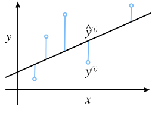

# Linear Regression

The idea of **regression** problems is to simply predict a numerical value from a continuous numeric domain. Common examples includes predicting prices, length of stay, and numerous others. Not every prediction is regression though.

For example we wish to estimate the price of houses based on thier area and age. In the terminology of machine learning, the dataset is called *training dataset* or *training set*, and each row containing the data corresponding to one sale is called an *example* or *sample*, the thing we trying to predict is called a *label*, and finally the variables upon which the prediction are based are called *feature*.

## Basics 
Linear regression flows from a few assumptions. First, we assume that the relationship between features $x$ and labels $y$ is approximately linear. And noise is well behaved.

### Model
At the heart of every regression problem is linear formula of the expected value of the target, which is a weighted sum of the features.

Here $w$ is called *weights*, and *b* is called a *bias*. The weights determine the influence of each feature on our prediction. The bias determines the vlaue of the estimate when all features are zero.

> Even though we will **never** start with zeros, and will always start with `randn`, we still need bias because it allows us to express all linear functions of our features (rather than lines that pass through origin)

$$
\hat{y} = w_1x_1 + \dots w_dx_d + b
$$

Collecting everything into vectors, we can express our model like this

$$
\hat{y} = \mathbf{w}^T\mathbf{x} + b
$$

Here the vector $\mathbf{x}$ corresponds to the feature of a single example. it'll be convenient to refer to features of our entire dataset as Matrix $\mathbf{X} \in \R^{n\times d}$ that containes one row for every example.

$$
\hat{y} = \mathbf{X}\mathbf{w} + b
$$

Our goal is to choose (or make our model adjust itself to) the best weights $w$ and the bias $b$ that, on average make the model prediction fit the true labels as closely as possible.

### Loss Function 
Naturally we need a measure of prediction goodness. *Loss functions* quantify the distance between the *real* and the *predicted* values of the target. The loss will usually be a nonnegative number where **smaller is better** and perfect is at 0.

For regression problems, the most common loss function is **Mean Squared Error* which is simply the average of all errors squared 

$$ 
L(\mathbf{w},b) = \frac{1}{n} \sum^{n}_{i = 1}\frac{1}{2}(
    \hat{y}_i - y_i
)^2
$$

$$
= \frac{1}{n} \sum^{n}_{i = 1}\frac{1}{2}(
    \mathbf{w}^Tx_i + b - y_i
)^2
$$

> Note that large differences between *estimates* and *targets* lead to even larger contribution to the loss, due the quadratic. This could be problimatic as it makes the model excessively sensitive to abnormal data.

### Optimization 

#### Analytic Solution
We can find the optimal parameters analytically by applying a simple formula as follows. First, we will move the bias into the parameter $w$ by appending a column to $X$ consisting of 1s. Then our problem is to minimize $||\mathbf{y-Xw}||^2$, as long as $X$ is invertable we would be able to solve this by a simple derivative wrt $w$ and setting it to zero 

$$
\mathbf{w} = (X^TX)^{-1}X^Ty
$$

But while this seems like good luck, it's requirements is strict which exclude almost all exciting aspects of deep learning.

#### Minibatch Stochastic Gradient Descent (SGD)
The key technique for optimizing nearly every deep learning model, consists of iteratively reducing the error by updating the parameters in the direction that incrementally lowers the loss function. This algorithm is called *gradient descent*.

The most naive application of gradient descent consists of taking the derivative of the loss function, which is an average of the losses computed on every single example in the dataset. 
This is called ***batch gradient descent***. In practice this is extremely inefficient and slow, as we must loop over the entire dataset to make a **single update**.

The other extreme is to consider only a single example at a time and to take update steps based on one observation at a time.
The resulting algorithm, ***stochastic gradient descent*** can be effictive, even for large datasets, but it has drawbacks, both computational and statistaical. 
One problem is that CPU/GPUs are a lot faster at multiplying and adding numbers than they are at moving data from memory to cahce.
Also it's much more efficient to perform matrix-vector multiplication that vector-vector multiplication.
A seconed problems is that some nueral network layers require more than one example at a time.

The solution to both problems is take a *minibatch* of examples instead of full batch or single sample at a time.
The specific choice of size depends on many factors, such that memory, the choice of layer, the total dataset size.

Despite all that, a number between 32 and 256, preferably a multiple of a large power of 2, is a good start. And this leads us to ***minibatch stochastic gradient descent***

In it's most basic form, in each iteration $t$, we randomly sample a minibatch $\mathcal{B}_t$ which consists of a fixed number of examples $|\mathcal{B}|$. We then compute the derivative (gradient) of the average loss on this minibatch.

Finaly, we multiply the gradient by a predetermined small positive value $\eta$ called the *learning rate*, and subtract the result from the current parameters values. 

$$
(w,b) - \frac{\eta}{|\mathcal{B}|}\sum_{i\in \mathcal{B}}\frac{\partial}{\partial (w,b)}l_i(w,b) \to (w,b)
$$

After training for some predetrmined number of iterations, we record the estimated model parameters, denoted $\hat{w}, \hat{b}$.